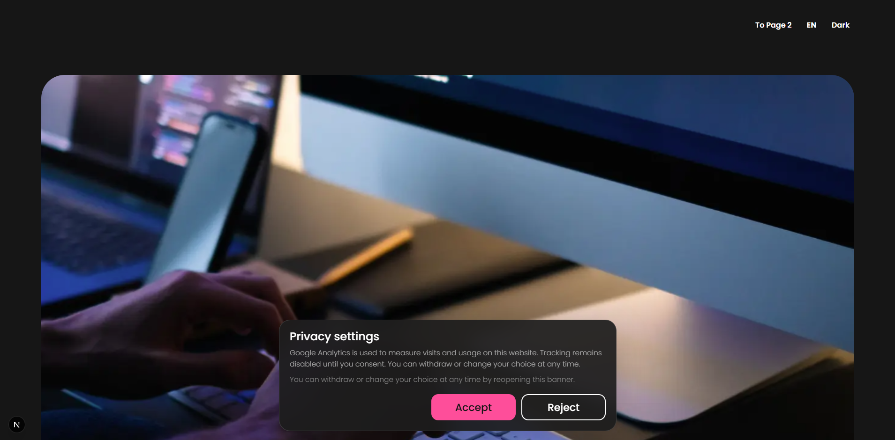
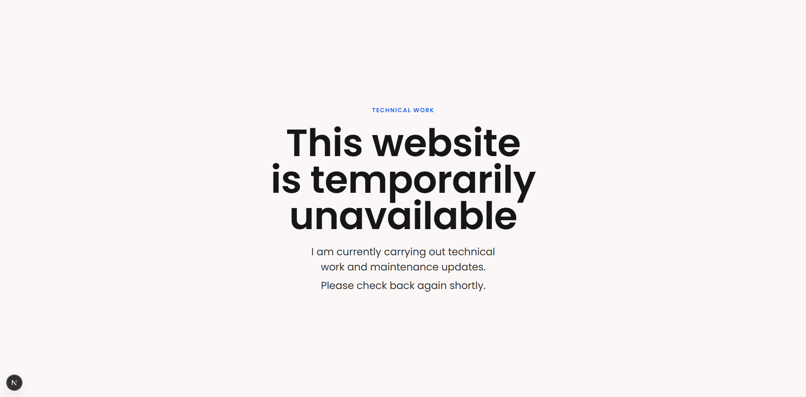

# Next.js GSAP Internationalized Starter

A production-minded Next.js starter for multilingual websites with localized SEO, GSAP animations, Lenis smooth scrolling, consent-controlled Google Analytics, light and dark themes, and an environment-controlled maintenance mode.

The project includes two example pages, translated interface copy, responsive typography, a custom 404 page, and reusable animation hooks. It is intended as a clean foundation rather than a finished website.

## Preview

https://github.com/user-attachments/assets/58202147-6924-4dfb-bd05-193b523fc680

### Localized consent



### Custom 404 page



## Features

1. **Automatic language detection and language switcher**  
   `next-intl` middleware detects the visitor's locale and redirects to a localized URL. The included switcher changes locale without losing the current route. Fifteen locales are configured. [Learn how to manage languages](#languages-and-translations).

2. **Translated content and localized metadata**  
   Each locale has its own JSON catalog for page text, controls, consent copy, accessibility labels, titles, descriptions, and keywords. Metadata helpers also generate canonical URLs, language alternates, Open Graph data, Twitter cards, and structured data. [Learn how to update metadata](#localized-metadata-and-seo).

3. **Locale-aware routing**  
   Localized `Link`, `redirect`, `useRouter`, and `usePathname` helpers are ready to use. Unknown public routes are rewritten to the localized 404 page, and the example pages demonstrate route-specific metadata. [Learn how to add routes](#routing).

4. **Environment-controlled maintenance mode**  
   Set one environment variable to redirect public traffic to a translated maintenance page. No page or routing rewrite is required. [Learn how to use maintenance mode](#maintenance-mode).

5. **Localized consent and optional Google Analytics**  
   Analytics loads only after the visitor accepts. Rejecting consent disables GA and removes common Analytics cookies. Leave the GA environment variable unset to run the starter without Google Analytics. [Learn how to configure consent and GA](#consent-and-google-analytics).

6. **Persistent light and dark themes**  
   The theme switcher follows the saved choice or the operating-system preference on the first visit. It applies the theme before hydration to avoid a color flash and stores later choices in `localStorage`.

7. **GSAP and ScrollTrigger ready to use**  
   GSAP is installed, ScrollTrigger is registered, route changes are handled, and reusable reveal modes are included. Add one data attribute to animate a new element. [Learn how to add animations](#gsap-animations).

8. **Lenis smooth scrolling integrated with GSAP**  
   Lenis is connected to ScrollTrigger, refreshed on meaningful viewport changes, reset on route changes, and used by the included scroll-to-top control. [Learn how Lenis is set up](#lenis-smooth-scrolling).

9. **International font fallbacks**  
   Poppins remains the primary Latin font while Montserrat and Noto Sans variants provide Cyrillic, Japanese, Korean, Thai, Simplified Chinese, and Traditional Chinese glyphs.

10. **SEO and starter essentials**  
    The project includes localized structured data, `sitemap.xml`, `robots.txt`, an Open Graph image, responsive layouts, translated accessibility text, TypeScript, and a custom localized 404 page.

## Tech Stack

- Next.js 16 with the App Router and Turbopack
- React 19 and TypeScript
- next-intl
- GSAP with ScrollTrigger
- Lenis
- next/font with multilingual font fallbacks

## Getting Started

### 1. Install dependencies

```bash
npm install
```

### 2. Create `.env.local`

```env
MAINTENANCE_MODE=false
NEXT_PUBLIC_GA_MEASUREMENT_ID=
```

Both variables are optional. The values above keep the normal site available and disable Google Analytics.

### 3. Start development

```bash
npm run dev
```

Open [http://localhost:3000](http://localhost:3000). The middleware redirects the unprefixed URL to the detected or default locale.

### 4. Verify a production build

```bash
npm run build
npm start
```

## Languages and Translations

The configured locales live in [`i18n/routing.ts`](i18n/routing.ts). Message catalogs live in [`components/messages`](components/messages), with `en.json` acting as the fallback schema.

The starter currently includes:

`en`, `ru`, `de`, `es`, `it`, `pt-br`, `fr`, `pl`, `cs`, `tr`, `ja`, `th`, `zh-cn`, `zh-tw`, and `ko`.

### Edit existing text

1. Add or update the key in `components/messages/en.json`.
2. Add the same key and its translation to every other locale JSON file.
3. Read the value in a client component with `useTranslations`:

```tsx
const t = useTranslations("home_template");

return <h1>{t("title")}</h1>;
```

4. Read the value in a server component with `getTranslations`:

```tsx
const t = await getTranslations({
  locale,
  namespace: "home_template",
});
```

If a translated catalog is missing a value, [`i18n/messages.ts`](i18n/messages.ts) merges in the English fallback.

### Add a language

1. Add the locale to `locales` in `i18n/routing.ts`.
2. Add it to `SUPPORTED_LOCALES` and the `Locale` type in `app/[locale]/types.ts`.
3. Create `components/messages/<locale>.json` using `en.json` as the schema.
4. Add the locale to the switcher group in `components/languageButton.tsx`.
5. Add its font mapping in `app/[locale]/ClientLocaleLayout.tsx` if it needs a dedicated script font.

## Localized Metadata and SEO

Page metadata is stored beside normal translations in each locale JSON file. The home page reads `metadata.home`, while page 2 reads `metadata.home_2` to demonstrate route-specific SEO.

```json
{
  "metadata": {
    "home": {
      "title": "Next.js GSAP Template",
      "description": "Your localized description",
      "keywords": ["localized keyword", "another keyword"]
    }
  }
}
```

[`app/[locale]/seo.ts`](app/[locale]/seo.ts) builds:

- Canonical URLs
- `hreflang` language alternatives and `x-default`
- Open Graph and Twitter metadata
- Organization, website, and webpage structured data

Before deployment, replace these starter values in `app/[locale]/seo.ts`:

```ts
export const BASE_URL = "https://your-domain.com";
export const SITE_NAME = "Your Site Name";
export const OG_IMAGE_PATH = "/img/your-og-image.png";
```

Also update the matching base URL in `app/sitemap.ts`. Replace `public/img/og_image.png` with your own 1200 x 630 social image.

## Routing

Import navigation helpers from [`i18n/routing.ts`](i18n/routing.ts), not directly from `next/navigation`, when navigation must preserve the locale:

```tsx
import { Link, useRouter } from "@/i18n/routing";

<Link href="/home-2">Page 2</Link>;
```

To add a public route:

1. Create the page under `app/[locale]`.
2. Add its normalized path to `PUBLIC_ROUTE_ALLOWLIST` in `proxy.ts`.
3. Add it to `PUBLIC_ROUTE_ALLOWLIST` in `app/sitemap.ts` if it should appear in the sitemap.
4. Add localized metadata for the route.

Routes not present in the proxy allowlist are rewritten to `/<locale>/404`.

## Maintenance Mode

The translated maintenance page is available at `/<locale>/maintenance`.

Enable site-wide maintenance mode in `.env.local`:

```env
MAINTENANCE_MODE=true
```

Restart the development server after changing the value. In production, set the same environment variable in your hosting dashboard and redeploy or restart the application.

When enabled, [`proxy.ts`](proxy.ts) redirects localized public requests to the maintenance route while preserving the visitor's locale. Set the value back to `false` or remove it to restore normal routing.

Edit the translated maintenance content under the `maintenance` key in every locale JSON file.

## Consent and Google Analytics

Add a GA4 measurement ID to enable Google Analytics:

```env
NEXT_PUBLIC_GA_MEASUREMENT_ID=G-XXXXXXXXXX
```

The flow is intentionally consent-first:

1. The localized banner opens when no consent choice is stored.
2. Google Analytics is not rendered before acceptance.
3. Accepting stores the choice and loads the GA script.
4. Rejecting disables GA and removes common `_ga`, `_gid`, `_gat`, and `_ga_*` cookies.
5. Dispatching a `consent:open` browser event opens the banner again so a footer privacy button can let visitors change their choice.

```ts
window.dispatchEvent(new Event("consent:open"));
```

To disable Google Analytics, remove `NEXT_PUBLIC_GA_MEASUREMENT_ID` or leave it empty. The consent interface remains available; remove `<ConsentManager />` from `app/[locale]/ClientLocaleLayout.tsx` only if the project does not need consent management at all.

Consent copy is translated under the `consent` key in each locale JSON file.

## Theme Switching

The active theme is stored as `color-scheme` in `localStorage` and applied as a `color-scheme` attribute on `<html>`.

Theme colors are defined in `public/css/main.min.css`:

```css
:root {
  /* light theme variables */
}

[color-scheme="dark"] {
  /* dark theme overrides */
}
```

The small inline script in `app/layout.tsx` applies the saved or system theme before React hydrates. The switcher logic lives in `components/headers/ColorSwitcher.tsx`, and its labels are translated under the `theme` key.

## GSAP Animations

GSAP and ScrollTrigger are installed and initialized. To reveal an element on scroll, add `data-scroll-reveal`:

```tsx
<section data-scroll-reveal="fade">...</section>
```

Available modes:

- `fade`
- `left`
- `right`
- `scale`

The reusable behavior lives in [`hooks/useGsapScrollScaleAnimations.ts`](hooks/useGsapScrollScaleAnimations.ts). It creates animations inside a GSAP context, refreshes ScrollTrigger, and cleans everything up when the route changes.

For a custom animation, create a client component or hook, register the required GSAP plugin, and clean up animations with `gsap.context(...).revert()`.

## Lenis Smooth Scrolling

[`components/scroll/LenisSmoothScroll.tsx`](components/scroll/LenisSmoothScroll.tsx) wraps the app with `ReactLenis` and connects Lenis to ScrollTrigger through `scrollerProxy`.

The integration also:

- Updates ScrollTrigger during Lenis scrolling
- Refreshes measurements after meaningful viewport changes
- Resets scroll position on route changes
- Cleans up listeners and proxies on unmount
- Falls back to native scrolling on iOS devices

Use `useLenis` in a client component when you need programmatic scrolling:

```tsx
import { useLenis } from "lenis/react";

const lenis = useLenis();
lenis?.scrollTo("#contact", { duration: 1.2 });
```

## Project Structure

```text
app/[locale]/             Localized routes, layouts, metadata, and SEO helpers
components/messages/     Translation catalogs
components/consent/      Consent state and Google Analytics loading
components/headers/      Header, language switcher, and theme switcher
components/scroll/       Lenis and scroll initialization
hooks/                    Reusable GSAP animation hooks
i18n/                    next-intl routing and message loading
public/css/               Theme and responsive styles
proxy.ts                  Locale middleware, route allowlist, and maintenance mode
```

## Before Deployment

- Replace `https://example.com` in `app/[locale]/seo.ts` and `app/sitemap.ts`.
- Replace the starter site name and Open Graph image.
- Set or remove `NEXT_PUBLIC_GA_MEASUREMENT_ID` intentionally.
- Confirm `MAINTENANCE_MODE=false`.
- Review every locale's copy and metadata.
- Run `npm run build`.

## License

MIT License

Copyright (c) 2026 Daniels Makarenko

Permission is hereby granted, free of charge, to any person obtaining a copy
of this software and associated documentation files, to deal in the Software
without restriction, including without limitation the rights to use, copy,
modify, merge, publish, distribute, sublicense, and/or sell copies of the
Software, and to permit persons to whom the Software is furnished to do so,
subject to the following conditions:

The above copyright notice and this permission notice shall be included in all
copies or substantial portions of the Software.

THE SOFTWARE IS PROVIDED "AS IS", WITHOUT WARRANTY OF ANY KIND, EXPRESS OR
IMPLIED, INCLUDING BUT NOT LIMITED TO THE WARRANTIES OF MERCHANTABILITY,
FITNESS FOR A PARTICULAR PURPOSE AND NONINFRINGEMENT. IN NO EVENT SHALL THE
AUTHORS OR COPYRIGHT HOLDERS BE LIABLE FOR ANY CLAIM, DAMAGES OR OTHER
LIABILITY, WHETHER IN AN ACTION OF CONTRACT, TORT OR OTHERWISE, ARISING FROM,
OUT OF OR IN CONNECTION WITH THE SOFTWARE OR THE USE OR OTHER DEALINGS IN THE
SOFTWARE.
